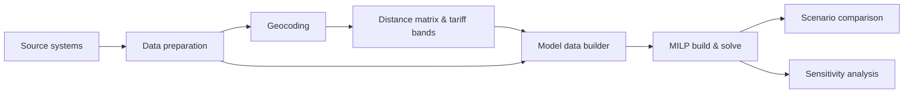

# Methodology

This page describes the end-to-end approach behind the depot network optimiser at a
conceptual level: how the inputs are prepared, how the model is assembled, and how
scenario and sensitivity analyses turn it into decision support. The mathematical
details are in [model_formulation.md](model_formulation.md).

## 1. Business question

A service organisation stores equipment in a network of depots and delivers it to, and
collects it from, customer sites. The footprint grew over time and may no longer fit
where demand is today. The questions are:

- Which depots should be **kept**, which should be **closed**, and would opening a
  **new site** pay off?
- Which depot should serve each **demand zone**?
- What does each option cost in rent, fixed operations, delivery, stock repositioning,
  capacity extensions and one-off closing or opening costs?

## 2. Data preparation

| Input | Content | Typical preparation |
|---|---|---|
| Demand | delivered units per customer site, product type and date | filter to the analysis window; drop cancelled or technical records and placeholder identifiers; normalise "unknown" labels to missing; aggregate to zone × product × day |
| Depots | location, status, rent, fixed costs, capacity, one-off costs | standardise names to ids; monthly rent as the reference unit; impute missing values explicitly and flag them |
| Inventory | units per depot and product that are not at a customer site | take a snapshot at the start of the horizon |
| Returns | units coming back from customers | map each return to its receiving depot and date |
| Exogenous inflows | arrivals the model does not decide (e.g. from a central hub) | same shape as returns |
| Tariffs | rate per unit-km by distance band and carrier option | validate that every band has a rate for every option |

Pre-solve checks:

- **Schema and referential integrity** (`NetworkDataset.validate`): required columns,
  types and ranges, unknown ids, duplicates.
- **Supply vs. demand** (`check_supply`): a product whose demand exceeds its total
  supply can only be balanced through penalised shortage. That usually points to a
  data issue, such as a missing inventory snapshot or a wrong product mapping.

**Demand zones.** Customer sites can be modelled one by one or grouped into zones
(postal areas, grid cells or clusters). Grouping reduces the number of binary
assignment variables with little loss of accuracy.

## 3. Geocoding

Customer and depot addresses are converted to coordinates with a geocoding service:

1. Build a clean address string (street, postal code, city, country) and skip
   placeholder or free-text entries.
2. Send addresses in batches where the service supports it, and fall back to single
   requests otherwise.
3. **Sanity-filter** the results with a bounding box of the service area
   (`geo.filter_to_bbox`), because wrong hits are usually far away.
4. **Cache** results in a persistent table and geocode only new addresses on later
   runs (incremental refresh).

## 4. Distance matrix and tariff bands

For every zone–depot pair (and depot–depot pair for transfers):

1. **Road distance and travel time** come from a routing engine with a truck profile
   (`geo.routing.RoutingProvider`). Matrix endpoints limit the number of
   origin–destination pairs per request, so zones are sent in chunks of
   $\lfloor \text{max\_pairs} / \lvert D\rvert \rfloor$ origins.
2. **Fallbacks**: if a matrix request fails, the pairs are requested one by one. If
   that also fails, the great-circle distance times a detour factor is used
   (`HaversineRoutingProvider`).
3. **Great-circle distance** is always computed. It selects the **tariff band**
   (fixed-width distance bands with an open-ended last band), which matches how
   freight tariffs are usually quoted.
4. **Blended rate per band**: tariffs of several carrier options (own fleet vs.
   external carrier, single vs. double load) are weighted by their expected volume
   shares.
5. The **unit delivery cost** is road km × blended rate × round-trip factor.
6. The matrix is stored and refreshed **incrementally**: only new zone–depot pairs are
   routed. The refresh can run as a scheduled job.

## 5. Model building

`depot_opt.data.builder.build_model_data` turns the tables into sets and parameter
dictionaries:

- restricts zones to those with demand in the horizon, and arcs to pairs with a known
  distance;
- scales monthly costs to the horizon length and amortises one-off costs;
- applies per-depot capacity overrides from the scenario;
- derives transfer costs from the tariff when no depot–depot table is given.

`DepotNetworkModel` then creates the variables, adds each cost component as a named
expression, and adds the constraint families enabled in YAML. Solvers are
interchangeable: CBC by default, with HiGHS or Gurobi as alternatives. Each takes a
time limit, a relative MIP gap and a thread count.

**Time granularity.**

- *Aggregate* answers the strategic footprint question quickly.
- *Full* adds day-level stock dynamics.
- *Rolling* solves month by month and carries each month's ending stock into the next,
  which keeps long horizons tractable.

## 6. Scenario analysis

A scenario is a YAML file that `extends` the base configuration and changes only what
differs. All scenarios run on the **same dataset** and are compared with
`compare_scenarios`, which reports cost by component, kept / closed / opened depots,
transferred units, shortages and expansion batches.

| Scenario type | Levers |
|---|---|
| **Baseline (as-is)** | current depots forced open, no candidates; only assignments are optimised. This is the reference for every comparison. |
| **Single-site closure** | one depot forced closed, the rest as-is. Shows the cost of absorbing its customers and stock. |
| **Network redesign** | free keep/close decisions, with regional coverage and a minimum network size |
| **Greenfield / relocation** | candidates allowed, capped number of new sites, service-distance limits |
| **Capacity relief** | soft capacity with expansion batches; selected depots unlimited |
| **Operating model** | round-trip factor, carrier mix, split vs. single sourcing |

The savings of a scenario are measured against the baseline, **excluding the shortage
penalty**. A scenario with shortages is flagged instead of ranked.

## 7. Sensitivity analysis

Model inputs are uncertain, so the recommended network should hold up under
reasonable changes. `depot_opt.scenarios.sensitivity.sweep` re-solves a scenario while
varying one lever at a time:

- **cost levels**: rent, fixed costs, tariffs and one-off costs, as multipliers on data
  columns (`data:depots.rent_cost_per_month`);
- **operating assumptions**: round-trip factor, carrier mix, amortisation period;
- **policy limits**: maximum service distance, maximum number of open depots or
  closures;
- **demand**: scaling demand up or down to test growth or decline.

A decision that stays the same across the tested range is **robust**. Where it
changes, the tipping points (break-even rent, break-even distance) are the key message
for decision makers.

## 8. Validation and interpretation

- **Status first**: only optimal (or gap-bounded feasible) solutions are reported. In a
  rolling run, a non-optimal window stops the chain by default.
- **Cost reconciliation**: the named components add up exactly to the objective.
- **Shortage inspection**: positive shortages are listed per depot, product and date,
  and are treated as data or capacity issues to resolve, never as a result.
- **Plausibility**: compare the optimised as-is assignment with the historical one.
  Large differences often reveal distance or tariff errors.
- **Limitations**: costs are linear in volume; demand is deterministic within a run
  (uncertainty is handled through scenarios); labour, service quality and transition
  effects are captured only through constraints or one-off costs.

## 9. Operationalisation

- Data refresh (geocoding, distance matrix) runs as a scheduled, incremental pipeline
  that writes to reference tables.
- The optimiser reads those tables through the ODBC loader. Credentials and table
  names come only from environment variables or a secrets store.
- Outputs are tidy CSV tables that can be loaded into a BI tool: depot decisions,
  assignments, stock, transfers, shortages, expansion and cost breakdown.
